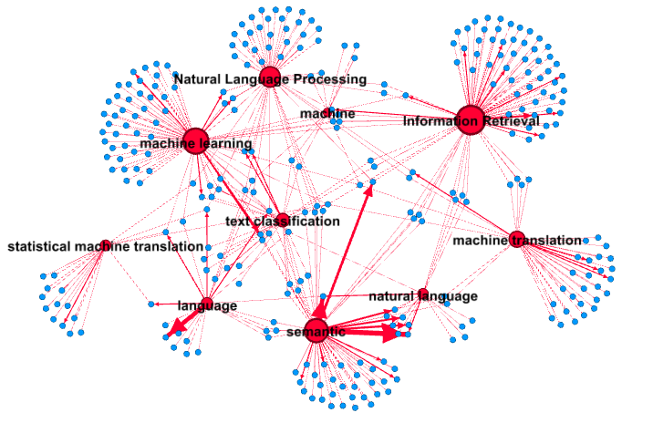
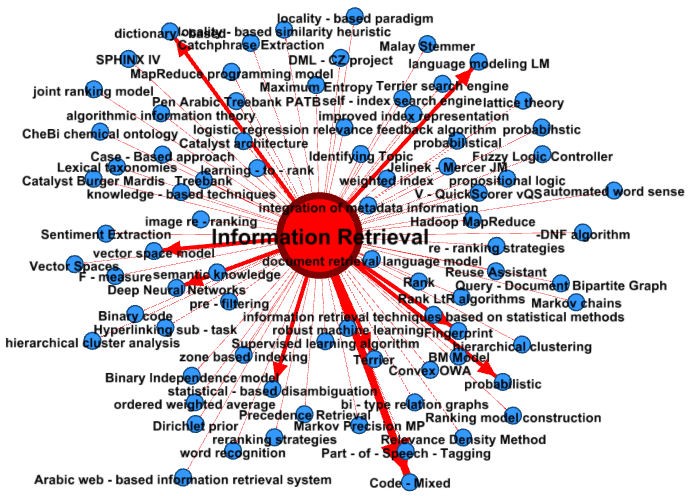

# 领域知识图谱构建
本项目旨在构建计算机领域的领域-技术知识图谱，主要包含3部分：
1. 命名实体识别，提取出论文摘要中的领域词和技术词，即`FIELD`和`TEC`两类，在BERT模型基础上添加了些内容，包括：
    - 用半监督熵正则化方法融合无标注数据；
    - 摘要中重要实体会出现在多个句子中，将输入变为多个句子；
    - 可以选择在预测的时候是否将`wordpiece`后的后面几个`token`（对应label为`X`）也进行loss计算。
2. 文档聚类，用于将相似的论文摘要聚成一类，在文档向量化模型中对实体词的loss进行加权计算，以使向量包含更多实体词信息。
    - 用Masked Doc2vec(MD2vec)进行文档向量化，`doc_embed.py`中也有`TF-IDF`,`doc2vec`等方法来进行对比。
    - 聚类使用`kmeans`方法。
    - 聚类目的是缩小图谱规模，发现子领域。
3. 用`gephi`绘制知识图谱。 

# MD2vec
本项目借用BERT模型的MASK LM 思想，提出MD2vec模型用于生成文档向量，相比doc2vec，
doc2vec中的DM模型是根据有限窗口内的词直接求和来预测下一个词，
这意味着其并不关注窗口内词的序列信息，也不区分那些词的权重，
而MD2vec是对所有非“[mask]”词的加权求和，在权重计算上考虑到
了不同词的本身信息（word embedding）以及词的位置信息（position embedding）。
MD2vec模型如下图所示：

# NER_projects
## bert_model
需下载预训练模型文件：
- `bert_config.json`
- `pytorch_model.bin`
- `vocab.txt`

## data
- conll2003: conll 2003数据集
    - full: 未经拆分的全量数据
        - BIO: BIO标注格式，其中`tiny.txt`是用于调试的数据集
        - BIOES: BIOES标注格式，通过[`bio2bioes.py`](NER_projects/util/bio2bioes.py)文件转换而来
            
        |文件名|文档数|句子数|词数|
        |----|-----|----|----|
        |train|946|14987|203621|
        |dev|216|3466|51362|
        |test|231|3684|46435|
        |tiny|2|30|658|
            
    - semi: 按照1:10的比例拆分训练数据得到
        - BIOES: 采用BIOES标注格式
        
        |文件名|文档数|句子数|词数|
        |----|-----|----|----|
        |train|86|1356|17028|
        |train_unlabeled|860|13631|186593|
        |dev|216|3466|51362|
        |test|231|3684|46435|
        |tiny|2|30|658|
        |tiny_unlabeled|20|235|3446|
            
- ai: 8488篇来自[Semantic Scholar](https://www.semanticscholar.org/)中`Computer Science`领域论文的摘要信息。
    - semi:
        - BIOES:
        
        |文件名|文档数|句子数|词数|备注|
        |----|-----|----|----|---|
        |data_all|8488|1028088|59635|标注默认为'O'|
        |train|140|972|17074|人工标注|
        |train_unlabeled|1400|9760|168760|用于半监督学习的部分未标注数据，标注默认为'O'|
        |dev|46|335|5801|人工标注|
        |test|46|309|5413|人工标注|

## models
配置文件为`task_config.yaml`
1. `cal_X_loss`：可以选择是否将label为`X`的token的loss也计算进总loss中。
2. `ssl`：可以选择是否使用半监督熵正则化的方法将无标注数据也计算一个loss，然后融合到有标注数据的loss中。
当为`true`时，必须保证相应数据目录下有无标注数据`train_unlabeled.txt`文件。
3. `doc_level`：可以选择是否使用文档层面的输入形式。两种情况都要保证输入序列不超过`max_seq_length`参数以及
BERT预训练模型中`max_position_embeddings`参数。为`false`时，输入就是一个句子；
为`true`时，输入为同一篇文档中尽可能多的句子，当一整篇文档的所有句子不能作为输入时，会进行切分而不是直接丢弃多余的。

模型结构分为`embedder`,`encoder`,`decoder`：
1. `embedder`：可选择随机初始化`RandomEmbed`或者用BERT预训练模型`BertEmbed`；
2. `encoder`： 中间层，可选 `MultiAttn`（等价于BERT里面的`Multi-Head Attention`） 或者 `BiLSTM`
3. `decoder`：输出层，可选`SoftmaxDecoder`或者`CRFDecoder`

# 图谱示例：
下图为某个聚类的领域-技术实体，该聚类主要和“信息”“语言”相关，选择了top10领域实体（红色）展现，蓝色为相关技术实体:

`Information Retrieval`领域详情：

